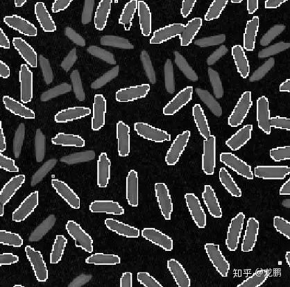
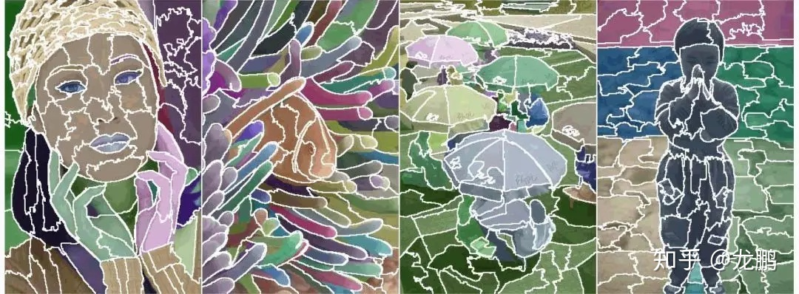
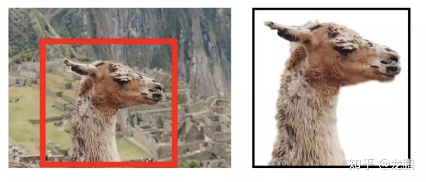
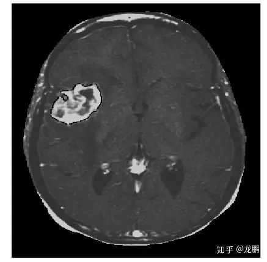
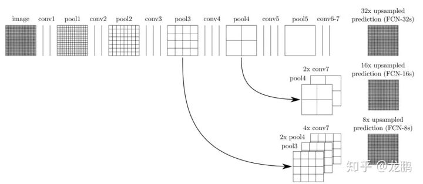
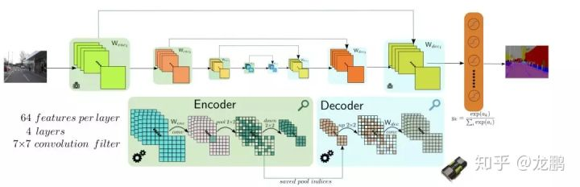
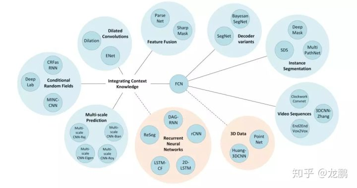

参考：[闲聊图像分割这件事儿](https://zhuanlan.zhihu.com/p/43422162)

### 1. 没有深度学习的那些年

#### 1.1 边缘与阈值法

简单的边缘检测也曾被用于图像分割，但是因为要做复杂后处理以及后面和其他方法有重叠，这里就不再说了，而是从阈值法开始说。

阈值法的**基本思想**是基于图像的灰度特征来计算一个或多个灰度阈值，并将图像中每个像素的灰度值与阈值相比较。

其中，使用最广泛也最具有代表性的是 **OTSU**[[1]](#ref1) 方法，它是用于灰度图像分割的方法，核心思想是使类间方差最大。

这样的方法，非常简单，要求被分割的物体颜色纹理比较紧凑，类内方差小，只适合一些文本图像的处理，比如车牌，比如指纹。

#### 1.2 区域增长和分裂

阈值法的一个硬伤是太简单粗暴，哪怕是自适应的局部阈值法，一样难逃无法分割类内方差较大的目标的宿命。它完全没有利用好像素的空间信息，导致分割结果极其容易受噪声干扰，经常出现断裂的边缘，需要后处理。

所以，区域增长法出现了，它通过一些种子点，再加上相似性准则来不断扩充区域直到达到类别的边界，这时候分割结果是连续的了。

区域分裂则是反过程，不再详述。区域增长法的佼佼者，就是分水岭算法[[2]](#ref2)。

分水岭算法是一种基于拓扑理论的数学形态学的分割方法，将图像中每一点像素的灰度值表示该点的*海拔高度*，每一个局部极小值称为*集水盆*，而集水盆的边界则是*分水岭*。分水岭算法有很多种实现算法，常用浸水模拟法。

分水岭算法对于弱边缘有不错的响应，因此常被用于材料图像的分割，以及产生超像素用于提高其他方法的分割效率。咱在硕士期间也与师姐鼓捣过半导体材料的分割，效果还不错。

说到这里，**超像素**也是很重要的一种方法，某种程度上也能被归为图像分割的方法。SLIC，Mean-shift 等都是非常经典的方法，去文 [[3]](#ref3) 中做更详细解读吧。笔者在很多的实际项目中都使用过，配合下面要讲的方法一起使用，绝配。

#### 1.3 图割
以 Graphcut [[4]](#ref4) 为代表的图割方法，是传统图像分割里面**鲁棒性最好**的方法，它是一种概率无向图模型（Probabilistic undirected graphical model），又被称 Markov random field 马尔可夫随机场。

Graphcut 的基本思路，就是建立一张图，其中以图像像素或者超像素作为图像顶点，然后优化的目标就是要找到一个切割，使得各个子图不相连从而实现分割，前提是移除边的和的权重最小。

后来图割方法从 MRF 发展到 CRF，也就是条件随机场。它通常包含两个优化目标，一个是区域的相似度，被称为**区域能量项**，即 piecewise 能量。一个是被切断边的相似度，被称为**边缘能量项**，即 pairwise 能量。它追求区域能量项的最大化以及边缘能量的最小化，也就是区域内部越相似越好，区域间相似度越低越好。

图割方法很通用，对于纹理比较复杂的图像分割效果也不错。缺点是时间复杂度和空间复杂度较高，所以通常使用超像素进行加速计算，上面的分水岭算法就可以拿来用用。

Graphcut 的迭代版本，也就是 Grabcut [[5]](#ref5) 更好用，它的基本思路是；使用混合高斯模型（Gaussian Mixture Model，GMM）替代了 Graphcut 基于灰度的模型，初始的混合高斯模型的构建，通过用户交互来指定，只需要指定确定性的背景像素区域即可，通常是画一个框。

多年以后再看下面这张图，效果依然是惊艳的，边缘很不错。不像上面的几个方法，图割方法仍然被广泛使用，deeplab系列的前几篇文章就用到了全连接的 CRF，它与 MRF 的区别可以参考这里：[Slide - Probabilistic Graphical Models](https://summerschool.vgiscience.org/PGM-VGI-SS-Michael-Yang.pdf)

图割方法很好用，是每个想做图像分割的同学必须掌握的，我从硕士论文，从第一个实习项目一直用到了现在。

#### 1.4 轮廓模型
轮廓模型大部分人可能不知道，它的**基本思想**是使用连续曲线来表达目标轮廓，并定义一个能量泛函，其自变量为曲线，将分割过程转变为求解能量泛函的最小值的过程。数值实现可通过求解函数对应的欧拉（Euler-Lagrange）方程来实现。包括以 snake 模型为代表的*参数活动轮廓模型*和以水平集方法为代表的*几何活动轮廓模型*。

当能量达到最小时的，曲线位置就处于正确的目标轮廓。

该类分割方法具有几个显著的特点：（1）由于能量泛函是在连续状态下实现，所以最终得到的图像轮廓可以达到较高的精度；（2）通过约束目标轮廓为光滑，同时融入其它关于目标形状的先验信息，算法可以具有较强的鲁棒性；（3）使用光滑的闭合曲线表示物体的轮廓，可获取完整的轮廓，从而避免传统图像分割方法中的预/后处理过程。

不过，缺点也很明显，比较敏感，容易陷入局部极值。

下面是我的硕士论文 [[6]](#ref6) 中采用水平集方法分割出的肿瘤，就是白色那一块。这个方法的数学味有点浓，考虑到咱们是闲聊，就不摆公式了，毕竟后面还有很多事。

### 2. 有了深度学习后

大家认可的第一篇采用深度学习方法来做图像分割的是 FCN [[7]](#ref7)。分类任务到了最后，图像被表征成了一个一维向量，而分割任务则需要恢复一张与原图大小相等的图，所以全连接自然是不行了。

不可免俗也放这张图，说的是在从最小分辨率的 featuremap 上采样的过程中，融合了卷积过程中同一分辨率大小的特征图。这种将网络浅层和深层信息融合的思想是分割网络的必备了，关于网络的结构，其实我们看segnet [[8]](#ref8) 会更有感觉，对称，优美，更符合我的审美。

有了 FCN 之后，各路方法大显神通。**不同的上采样方法，带孔卷积等增加感受野的方法，图片与特征的多尺度信息融合，增加 CRF 等后处理方法**。

万变不离其宗，最终分割结果的好坏往往取决于网络的表征能力，问题的简化，以及好的标注数据。刷比赛的那些技巧，我也不丰富就不多说了。

**更多的细节，先按下不表，下一期专门讲，如果等不及，看文 [[9]](#ref)，上个图先简单的爽上一爽。**

### 3. 分割不仅仅是分类问题
我们前面说的，都还是将分割当成一个分类问题来解读的，就是每个像素要被归为明确的类别。

然而分割的终极目标不只这一个，比如为了做背景替换的抠图这件事。

二分类的问题，前背景能完美融合才怪，经不起仔细观察。所以，我们需要带透明度通道的分割，或者先分割出来再利用泊松融合等技术进行边缘融合。

这就是一个 image matting 问题。image matting 问题可以用一个简单的数学表达式表达，$$I = aF + (1-a)B$$，其中 $$F$$ 是前景，$$B$$ 是背景，$$a$$ 是透明度，一张图可以看作是在透明度图像的控制下，前景和背景的线性融合。

只是，解这个问题有点病态，对于三通道的 RGB 图像，只有 3 个方程，却需要解出 6 个变量。所以像 closed matting 等方法都要做局部区域颜色不变的约束才能求出解析解。

Image matting 问题也从传统方法发展到了深度学习， [http://www.alphamatting.com](http://www.alphamatting.com) 这里有主流方法的比较，尽管一看。

之所以大家重新想起来这档事，是因为 adobe 前几年搞的 end to end 的方案 deep image matting [[10]](#ref10)重新吊起了大家的胃口。

在这个基础上，抠脑袋做个表情包 [[11]](#ref11) 也未必不可能，只是实际效果仍然欠缺。

技术当然不会止步于此，关注这个领域的朋友自然又会看到 siggraph2018 有人 [[12]](#ref12) 出来搞事情，原来是 MIT 和 Adobe，也是，没有 Adobe 谁有这能力。

我们只看文中的几个关键词，谱分割（Spectral Segmentation），Laplacian 矩阵，soft transitions 与 layers，SLIC 等。谱分割与 Laplacian 矩阵是 graphcut 的归一化版本 Normalized Cut 的核心，而 soft transitions 与 layers 是 Photoshop 最核心的思想，SLIC 则是用于减少计算量的超像素方法。

再加上深度学习，彻底的牛逼图像分割方法大融合了。

终于，传统方法又和深度学习走到了一起。咱们闲聊也该结束了，下次再说技术细节。

### 4. 总结

主要讲述了两类图像分割方法，即**传统方法**和**基于深度学习的方法**。

传统方法主要有：

- 边缘检测区域法和阈值法（代表性方法是 OTSU 方法）；
- 区域增长法和分裂法（增长法的佼佼者是分水岭算法，对弱边缘也有比较好的响应，常被用于材料图像的分割）（超像素也是很重要的一种方法，配合其他方法效果很好）；
- 以 Graphcut 方法为代表的图割方法是传统图像分割方法里鲁棒性最好的方法（Graphcut 的迭代版本，也就是 Grabcut，更好用，图割方法是必须要掌握的）；
- 轮廓模型包括以 snake 为代表参数活动轮廓模型和以水平集方法为代表的几何活动轮廓模型方法。

第一篇采用深度学习方法来做图像分割的是 FCN。

### 参考文献

<a id='ref1'>[1] Otsu N. A Threshold Selection Method from Gray-Level Histograms[J]. IEEE Trans.syst.man. & Cybern, 2007, 9(1):62-66.</a>

<a id="ref2">[2] L. Vincent and P. Soille, “Watersheds in digital spaces: an efficient algorithm based on immersion simulations,” IEEE Trans. Patt. Anal. Mach. Intell., vol. 13, pp. 583-598, 1991.</a>

<a id='ref3'>[3] Stutz D, Hermans A, Leibe B. Superpixels: an evaluation of the state-of-the-art[J]. Computer Vision and Image Understanding, 2018, 166: 1-27.</a>

<a id='ref4'>[4] Boykov Y Y, Jolly M P. Interactive Graph Cuts for Optimal Boundary & Region Segmentation of Objects in N-D Images[C]// IEEE International Conference on Computer Vision. IEEE Computer Society, 2001:105.</a>

<a id='ref5'>[5] Rother C, Kolmogorov V, Blake A. "GrabCut": interactive foreground extraction using iterated graph cuts[C]// ACM SIGGRAPH. ACM, 2004:309-314.</a>

<a id='ref6'>[6] 龙鹏. MRI医学图像增强与分割新方法[D]. 中国科学院大学, 2015.</a>

<a id='ref7'>[7] Shelhamer E, Long J, Darrell T. Fully Convolutional Networks for Semantic Segmentation[J]. IEEE Transactions on Pattern Analysis & Machine Intelligence, 2014, 39(4):1-1.</a>

<a id='ref8'>[8] Kendall A, Badrinarayanan V, Cipolla R. Bayesian segnet: Model uncertainty in deep convolutional encoder-decoder architectures for scene understanding[J]. arXiv preprint arXiv:1511.02680, 2015.</a>

<a id='ref9'>[9] Garcia-Garcia A, Orts-Escolano S, Oprea S, et al. A review on deep learning techniques applied to semantic segmentation[J]. arXiv preprint arXiv:1704.06857, 2017.</a>

<a id='ref10'>[10] Xu N, Price B L, Cohen S, et al. Deep Image Matting[C]//CVPR. 2017, 2: 4.</a>

<a id='ref11'>[11] Zhu B, Chen Y, Wang J, et al. Fast Deep Matting for Portrait Animation on Mobile Phone[C]//Proceedings of the 2017 ACM on Multimedia Conference. ACM, 2017: 297-305.</a>

<a id='ref12'>[12] Y. A., TAE-HYUN, OH, MATUSIK W. Semantic Soft Segmentation[J]. 2018.</a>